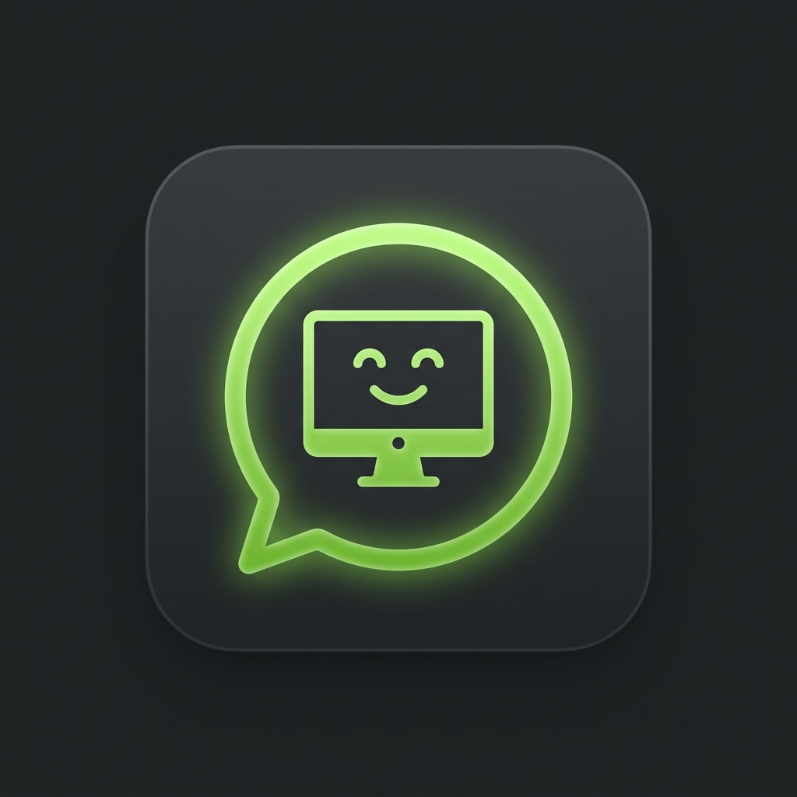

# DBS Dahua Access (Home Assistant Integration)

Integracja Home Assistant / HACS dla lokalnych kontrolerów dostępu Dahua. Projekt rozwijany jest jako integracja firmy **Digital Best Solutions** dla kontrolerów Dahua działających w LAN, bez zależności od chmury Dahua.



## Funkcje

* **Konfiguracja przez interfejs Home Assistant**: dodanie kontrolera przez IP, port, login i hasło.
* **Model urządzeń Home Assistant**: jeden fizyczny kontroler Dahua jest widoczny jako osobne urządzenie.
* **Encje drzwi i przejść**: przyciski otwarcia, status online, status drzwi i sensory ostatnich zdarzeń.
* **Nazwy z kontrolera**: integracja próbuje pobierać nazwę kontrolera oraz nazwy drzwi/przejść bezpośrednio z Dahua NetSDK.
* **Czytelne zdarzenia**: event `dbs_dahua_access_event` zawiera drzwi, czytnik, metodę, wynik, użytkownika, kartę i czas urządzenia.
* **Tagi Home Assistant**: odczyty kart emitują także `tag_scanned` jako `dahua:<numer_karty>`.
* **Obsługa wielu kontrolerów**: każdy kontroler jest osobnym wpisem konfiguracji.
* **Reconfigure i reauth**: zmiana IP/danych logowania oraz aktualizacja hasła bez usuwania integracji.

Kamery i NVR są poza zakresem pierwszej wersji integracji. Eksperymenty laboratoryjne pozostają w katalogu `tools/`.

## Status

Wersja `0.1.4` pobiera nazwę, rzeczywisty model i wersje urządzenia z właściwych zapytań SDK. Kod klasy urządzenia `56` jest rozpoznawany zgodnie z SDK jako seria kontroli dostępu, a nie DVR. Integracja nie tworzy przejść na podstawie stałej wartości zastępczej, zachowuje mapowanie widocznych drzwi `1..N` na kanały SDK `0..N-1` i wczytuje karty oraz użytkowników do natywnych tagów Home Assistanta.

W repozytorium są dołączone oficjalne wheel'e Dahua NetSDK dla:

* Linux x86_64,
* Linux i686,
* Windows amd64.

W pobranej paczce Dahua nie ma wheel'a Linux `arm64/aarch64`. Na Home Assistant OS uruchomionym na ARM64 integracja pokaże precyzyjny błąd braku NetSDK dla tej architektury, dopóki nie znajdziemy właściwej paczki Dahua ARM64.

## Instalacja przez HACS

1. W Home Assistant przejdź do **HACS** -> **Integracje**.
2. Kliknij menu w prawym górnym rogu i wybierz **Niestandardowe repozytoria**.
3. Wklej adres repozytorium:

   ```text
   https://github.com/rafalszm/DBS-Dahua-Access
   ```

4. Jako kategorię wybierz **Integracja**.
5. Zainstaluj **DBS Dahua Access** i zrestartuj Home Assistant.
6. Wejdź w **Ustawienia -> Urządzenia oraz usługi -> Dodaj integrację** i wyszukaj **DBS Dahua Access**.

## Konfiguracja

W formularzu integracji podajesz:

* adres IP lub hostname kontrolera,
* port Dahua NetSDK, domyślnie `37777`,
* login,
* hasło.

Integracja po połączeniu próbuje pobrać:

* numer seryjny kontrolera,
* nazwę urządzenia,
* model / typ urządzenia,
* dostępne drzwi lub przejścia,
* nazwy drzwi z konfiguracji albo z eventów kontrolera.

Integracja pyta kontroler o liczbę i nazwy przejść przez `GETSUBCONTROLLER_INFO`, a jeśli urządzenie tego nie obsługuje, próbuje jawnej liczby z `AccessControlGeneral`. Dla starszych kontrolerów weryfikuje kolejne kanały `AccessControl`, ale uznaje kanał wyłącznie wtedy, gdy odpowiedź ma `result=true` i zwraca dokładnie ten sam numer kanału. Nie używa listy blokady `ABLock` jako liczby drzwi i nie tworzy encji na podstawie stałej wartości. Nazwa kontrolera pochodzi wyłącznie z `General.MachineName`, jeśli kontroler ją odda.

Kanały NetSDK są numerowane od zera. Integracja pokazuje użytkownikowi przejścia od `1`, ale komendy otwarcia wysyła na odpowiadający im kanał SDK od `0`, więc kolejność przycisków jest zgodna z kolejnością kontrolera. Nazwy drzwi pochodzą z `GETSUBCONTROLLER_INFO`, konfiguracji `AccessControl` albo z `szDoorName` w evencie. Jeżeli dany firmware nie zwraca nazwy żadną z tych metod, pozostaje neutralne `Przejście <nr>`.

Karty są pobierane z rejestru `ACCESSCTLCARD`, wiązane z użytkownikami przez natywne usługi kart i użytkowników, a następnie dodawane do rejestru tagów HA jako `dahua:<numer_karty>`. Nazwa tagu jest nazwą użytkownika, nazwą karty albo identyfikatorem użytkownika, zależnie od danych faktycznie zapisanych w kontrolerze. Zwykły wspólny PIN (`PWD_ONLY`) nie wskazuje użytkownika; PIN osobisty lub tryb `UserID+PIN` jest przypisywany, gdy event zawiera `szUserID`.

## Eventy Home Assistant

Główny event:

```yaml
event_type: dbs_dahua_access_event
data:
  controller: KD1 PIWNICA KOZLA
  controller_serial: AF0D0F9PAJ827B8
  controller_ip: 10.10.20.32
  door: 2
  door_label: Magazyn
  reader: "3"
  event: access_granted
  method: card
  user_id: "8"
  user_name: Jan Kowalski
  card_tag_id: dahua:058D1C32
  device_time: "2026-09-19T19:12:51"
```

Dla kart emitowany jest również natywny event Home Assistant:

```yaml
event_type: tag_scanned
data:
  tag_id: dahua:058D1C32
```

## Rozwój lokalny

Pliki lokalne i sekrety są ignorowane przez git:

* `secrets/`
* `sdk/`
* `.venv/`
* `lab_captures/`

Bundlowane wheel'e NetSDK są trzymane w:

```text
custom_components/dbs_dahua_access/vendor/wheels/
```

Testy podstawowej normalizacji:

```powershell
.venv\Scripts\python.exe -m py_compile custom_components\dbs_dahua_access\*.py custom_components\dbs_dahua_access\dahua\*.py tests\test_normalizer.py
```

## Autor i licencja

Projekt jest rozwijany przez firmę **Digital Best Solutions** ([dbsservice.pl](https://dbsservice.pl/)).

Oprogramowanie jest udostępniane na warunkach określonych w pliku [LICENSE](LICENSE). Korzystanie z niego jest bezpłatne do celów prywatnych i niekomercyjnych. Komercyjne wdrożenie lub użycie w ramach prowadzonej działalności gospodarczej wymaga uzyskania pisemnej zgody oraz zakupienia licencji komercyjnej.
